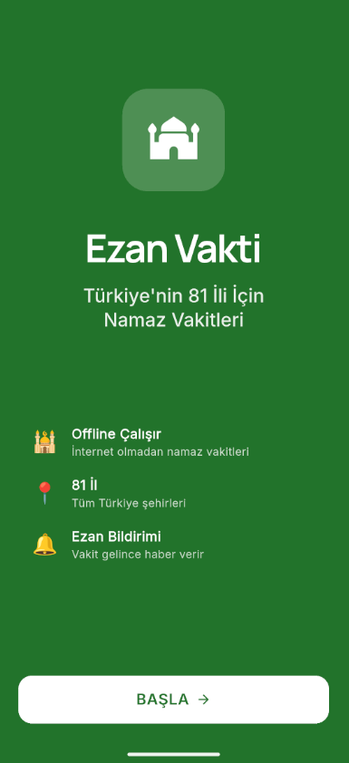
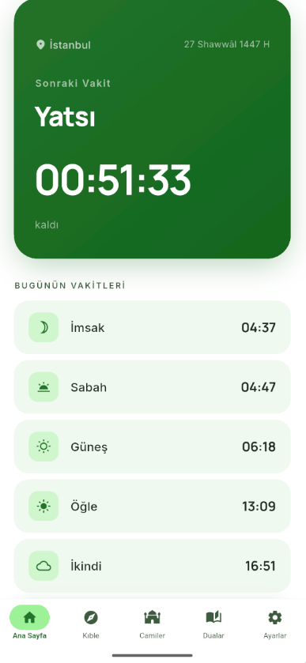
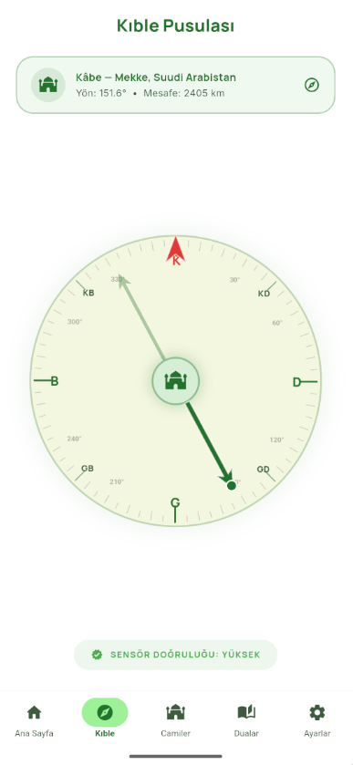
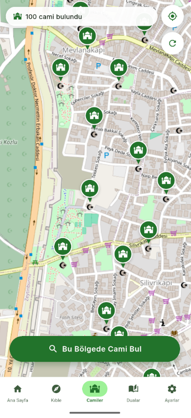
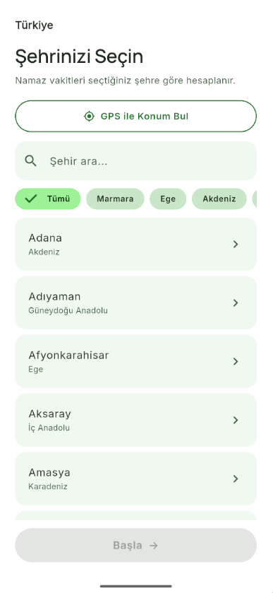
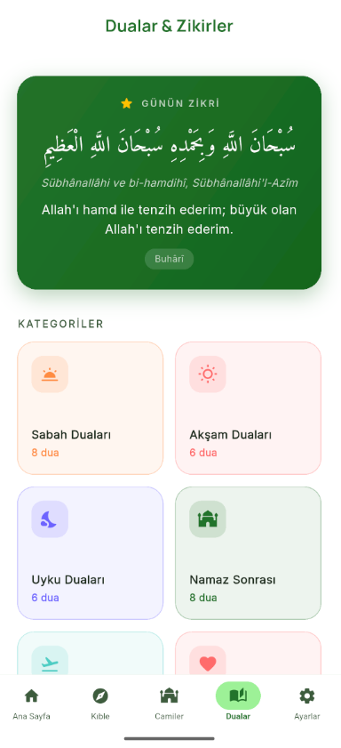
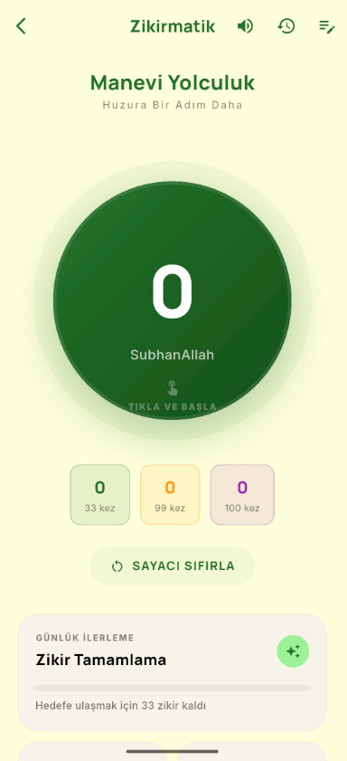
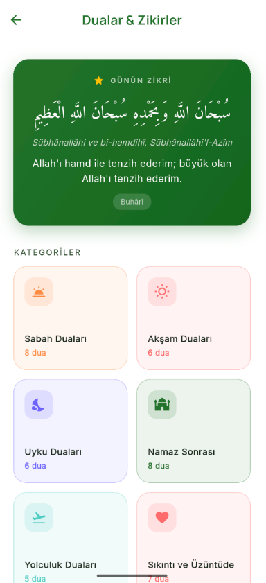

<div align="center">

# 🕌 Ezan Vakti

### Türkiye'nin En Güzel Namaz Vakti Uygulaması

<br/>

[](https://github.com/AllLiveSupport/ezan-vakti/stargazers)
[](https://github.com/AllLiveSupport/ezan-vakti/network/members)
[](https://github.com/AllLiveSupport/ezan-vakti/issues)
[](https://github.com/AllLiveSupport/ezan-vakti/commits/main)

<br/>

[](https://flutter.dev)
[](LICENSE)
[](https://github.com/AllLiveSupport)

<br/>


---

**✨ Gerçek Zamanlı Vakitler • 🔔 Akıllı Hatırlatıcı • 🧭 Kıble Pusulası • 🕌 Cami Bulucu • 📿 Zikirmatik • 📖 137+ Dua**

</div>

<br/>

---

## 📱 Uygulama Tanıtımı

**Ezan Vakti**, Türkiye'nin 81 ili için özel olarak tasarlanmış, modern ve kullanıcı dostu bir namaz vakti uygulamasıdır. 

Geleneksel tasarım anlayışını modern teknolojiyle birleştirerek, namaz vakitlerinizi takip etmeyi, kıble yönünüzü bulmayı ve yakınınızdaki camilere ulaşmayı kolaylaştırır.

> **🔓 Tamamen Ücretsiz ve Açık Kaynak** — Reklamsız, aboneliksiz, gizlilik odaklı.

<br/>

<div align="center">

| | | | |
|:---:|:---:|:---:|:---:|
|  |  |  |  |
|  |  |  |  |

</div>

<br/>

---

## 🌟 Özellikler

### 🕰️ Namaz Vakitleri & Geri Sayım
- **Gerçek Zamanlı Takip**: Kalan süreyi büyük ve okunaklı dijital saat ile gösterir
- **81 İl Desteği**: Türkiye'nin tüm illeri ve ilçeleri için hassas vakit hesaplaması
- **Hicri Tarih**: Miladi takvimin yanında İslami takvim desteği
- **3 Yıllık Veri**: 2026, 2027 ve 2028 yılları için önceden yüklenmiş vakit verileri — internet gerektirmez
- **Bölge Filtresi**: Marmara, Ege, Akdeniz, İç Anadolu, Karadeniz, Doğu ve Güneydoğu Anadolu bölgelerine göre hızlı şehir seçimi

<div align="center">

| **Ana Sayfa — Vakit Takibi** | **Şehir Seçimi** |
|:---:|:---:|
|  |  |
| *Sonraki vakit için geri sayım ve günlük vakit listesi* | *81 il, bölge filtresi ile hızlı şehir seçimi* |

</div>

---

### 🧭 Kıble Pusulası
- **Mesafe Bilgisi**: Kâbe'ye olan uzaklığı kilometre cinsinden gösterir
- **Dairesel Pusula**: Geleneksel pusula tasarımı ile sezgisel kullanım
- **Sensör Doğruluğu**: Cihaz sensör kalitesi göstergesi

<div align="center">

| **Kıble Pusulası** |
|:---:|
|  |
| *Kâbe yönünü ve mesafesini gösteren interaktif pusula* |

</div>

---

### 🕌 Cami Bulucu (Harita)
- **Konum Tabanlı Arama**: GPS ile anında yakınınızdaki camileri listeler
- **Detaylı Bilgi**: Mesafe, yürüyüş süresi ve adres bilgisi
- **Yol Tarifi**: Tek tıkla Google Maps veya harita uygulamalarına yönlendirme
- **Offline Önbellek**: Daha önce görüntülenen camiler hızlı erişim için kaydedilir

<div align="center">

| **Cami Haritası** |
|:---:|
|  |
| *Yakınınızdaki camileri harita üzerinde görüntüleme* |

</div>

---

### � Dualar & Zikirler
- **137+ Dua**: 22 kategoride kapsamlı dua koleksiyonu
- **Günün Zikri**: Her gün farklı bir zikir önerisi
- **Kategorize Edilmiş Dualar**: Sabah, akşam, uyku, namaz sonrası, Cuma, yolculuk, sınav, hastalık ve daha fazlası
- **Arapça, Türkçe & Okunuş**: Orijinal Arapça metin, Türkçe meali ve Latin harfli okunuşu
- **Güvenilir Kaynaklar**: Her duanın hadis kitabı veya Kur'an sure/ayet kaynağı
- **Kopyalama**: Tek tıkla duayı panoya kopyalama

<div align="center">

| **Dualar & Zikirler** |
|:---:|
|  |
| *22 kategoride 137+ dua — Kur'an ayetleri ve sahih hadislerden* |

</div>

---

### 📿 Zikirmatik (Dijital Tesbih)
- **Hedef Sayıları**: 33, 99 ve 100 sayı hedefleri ile otomatik tamamlama
- **Sesli Bildirim**: Her hedefe ulaşıldığında sesli onay
- **Günlük İstatistik**: Tamamlanan zikir sayısı takibi
- **Özelleştirilebilir İsim**: Zikir adını kendiniz belirleyin (SubhanAllah, Elhamdulillah, vb.)

<div align="center">

| **Zikirmatik** |
|:---:|
|  |
| *Dijital tesbih ile zikir sayımı ve takibi* |

</div>

---

### ⏰ Kerahat Vakitleri
- **Günlük Grafik**: 24 saatlik dairesel görsel ile kerahat vakitleri
- **Detaylı Açıklamalar**: Her kerahat vaktinin nedenleri ve hükümleri
- **Serbest Vakitler**: Güvenli namaz kılma aralıklarını gösterir
- **Özel Bildirimler**: Kerahat vaktine girildiğinde/çıkıldığında uyarı

<div align="center">

| **Kerahat Vakitleri** |
|:---:|
|  |
| *24 saatlik kerahat vakitleri görsel takvimi* |

</div>

---

### 🎉 Hoş Geldiniz & Onboarding
- **Güzel Karşılama Ekranı**: Uygulamanın ilk açılışında kullanıcıyı karşılayan modern tasarım
- **Kolay Kurulum**: Şehir seçimi ve izin ayarları tek adımda

<div align="center">

| **Hoş Geldiniz** |
|:---:|
|  |
| *Modern ve sıcak karşılama ekranı* |

</div>

---

### 🔔 Akıllı Alarm Sistemi
- **Otomatik Alarm**: Her vakit için otomatik alarm kurma
- **Ezan Sesi**: Gerçek ezan sesiyle bildirim
- **Sessiz Mod**: Rahatsız etmeme seçeneği
- **Sabit Bildirim**: Anlık vakit bilgisini bildirim panelinde gösterir
- **Foreground Service**: Uygulama kapatılsa bile alarm çalışmaya devam eder

---

## 🛠️ Teknolojiler

Bu uygulama, modern ve performanslı bir deneyim sunmak için en son teknolojilerle geliştirilmiştir:

| Teknoloji | Kullanım Alanı |
|:---|:---|
| **Flutter 3.x** | Cross-platform UI framework |
| **Dart** | Programlama dili |
| **Riverpod** | State management |
| **Drift (SQLite)** | Yerel veritabanı |
| **Geolocator** | Konum servisleri |
| **Flutter Map + OSM** | Açık kaynak harita altyapısı |
| **Flutter Compass** | Pusula sensörü |
| **Alarm** | Gerçek zamanlı bildirimler |
| **Dio** | HTTP istemci |

---

## � Proje Yapısı

```
ezan_vakti/
├── assets/
│   ├── data/
│   │   ├── duas.json              # 137+ dua verisi
│   │   ├── prayer_times/          # 2026-2028 vakit verileri
│   │   │   ├── 2026/              # 81 il × JSON
│   │   │   ├── 2027/
│   │   │   └── 2028/
│   │   ├── turkey_cities.json     # Şehir ve bölge verileri
│   │   └── world_cities.json      # Dünya şehirleri
│   ├── images/                    # Uygulama görselleri
│   └── sounds/                    # Ezan ve bildirim sesleri
├── lib/
│   ├── core/
│   │   ├── constants/             # Sabitler
│   │   ├── database/              # Drift veritabanı
│   │   ├── network/               # Servisler (dua, namaz, cami, kıble)
│   │   ├── services/              # Alarm, bildirim, ses servisleri
│   │   └── theme/                 # Uygulama teması
│   ├── features/
│   │   ├── home/                  # Ana sayfa
│   │   ├── qibla/                 # Kıble pusulası
│   │   ├── dua/                   # Dualar ekranı
│   │   ├── tasbih/                # Zikirmatik
│   │   ├── calendar/              # Takvim
│   │   ├── kerahat/               # Kerahat vakitleri
│   │   ├── map/                   # Cami haritası
│   │   ├── settings/              # Ayarlar
│   │   └── onboarding/            # Hoş geldiniz ekranları
│   └── shared/
│       ├── models/                # Veri modelleri
│       └── providers/             # Riverpod provider'lar
└── screenshots/                   # Ekran görüntüleri
```

---

## 📥 Kurulum

### GitHub'dan İndirme (APK)
1. Bu repository'i yıldızlayın ⭐
2. Sağdaki **Releases** bölümünden en son sürümü indirin
3. `app-release.apk` dosyasını Android cihazınıza yükleyin
4. "Bilinmeyen kaynaklardan yükleme" izni verin

### Kaynak Kodundan Derleme
```bash
# Repository'yi klonlayın
git clone https://github.com/AllLiveSupport/ezan-vakti.git

# Proje dizinine girin
cd ezan-vakti

# Bağımlılıkları yükleyin
flutter pub get

# Android için derleyin
flutter build apk --release

# Veya doğrudan çalıştırın
flutter run
```

### Gereksinimler
- Flutter SDK 3.x+
- Dart SDK 3.x+
- Android SDK 21+ (Android 5.0 Lollipop ve üzeri)

---

## 🤝 Katkıda Bulunma

Bu proje açık kaynaklıdır ve topluluk katkılarına açıktır!

1. Bu repo'yu **⭐ yıldızlayın** (motivasyon kaynağı!)
2. Repository'i **fork** edin
3. Feature branch oluşturun (`git checkout -b feature/amazing-feature`)
4. Değişikliklerinizi commit edin (`git commit -m 'Add amazing feature'`)
5. Branch'inizi push edin (`git push origin feature/amazing-feature`)
6. **Pull Request** açın

> 💡 **İpucu**: Hata bildirimi veya özellik önerisi için [Issues](https://github.com/AllLiveSupport/ezan-vakti/issues) bölümünü kullanabilirsiniz.

---

## 📝 Yol Haritası

- [x] 81 il namaz vakti desteği (2026-2028)
- [x] Kıble pusulası
- [x] Cami bulucu (OpenStreetMap)
- [x] Zikirmatik (dijital tesbih)
- [x] 137+ dua (22 kategori)
- [x] Kerahat vakitleri
- [x] Akıllı alarm sistemi
- [x] Bölgesel şehir filtresi
- [x] Foreground service & sabit bildirim
- [ ] iOS desteği
- [ ] Ana ekran widget'ı
- [ ] Kadir Gecesi, Regaib Kandili özel bildirimleri
- [ ] Ramazan imsakiyesi
- [ ] Çoklu dil desteği (İngilizce, Almanca, Arapça)

---

## 📜 Lisans

Bu proje **MIT Lisansı** altında lisanslanmıştır. Detaylar için [LICENSE](LICENSE) dosyasına bakınız.

---

## 💚 Teşekkürler

Bu uygulama, Türkiye'nin dört bir yanındaki kullanıcıların namaz vakitlerini kolayca takip edebilmeleri için geliştirilmiştir. 

Her türlü geri bildirim, öneri ve katkınız bizim için değerlidir.

> *"Rabbimiz! Bize dünyada iyilik ver, ahirette iyilik ver ve bizi cehennem azabından koru."*
> — Bakara Suresi, 201

<div align="center">

<br/>

**❤️ Made with love in Turkey**

<br/>

[](https://github.com/AllLiveSupport)
[](https://github.com/AllLiveSupport/ezan-vakti)

</div>

